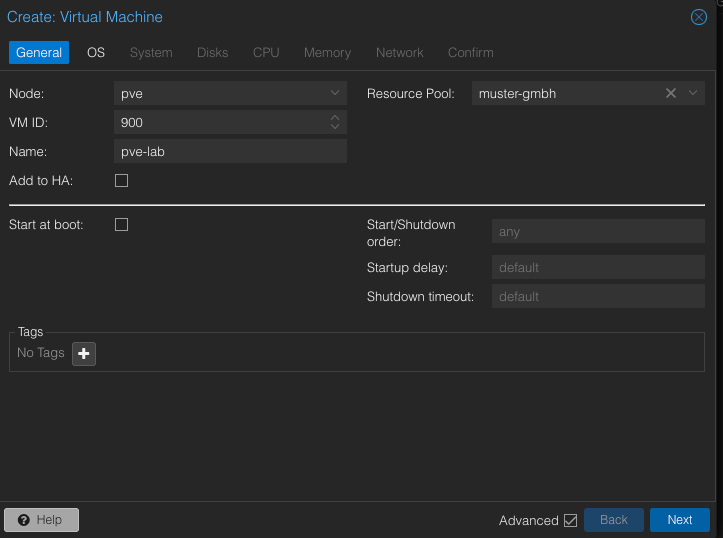
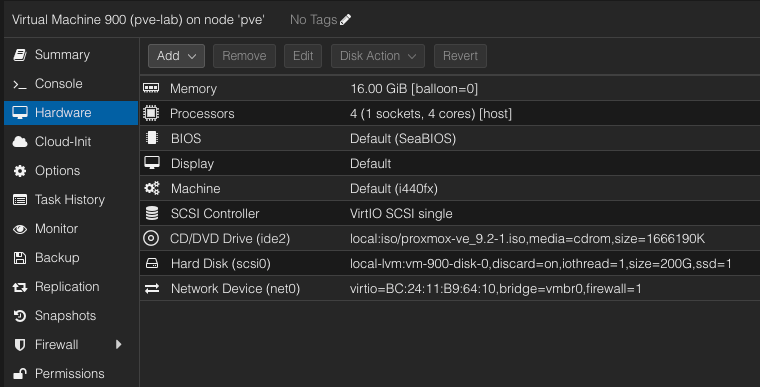
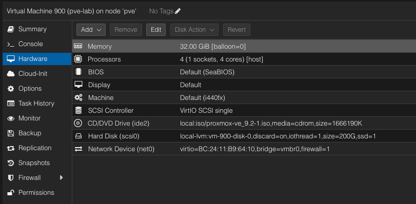
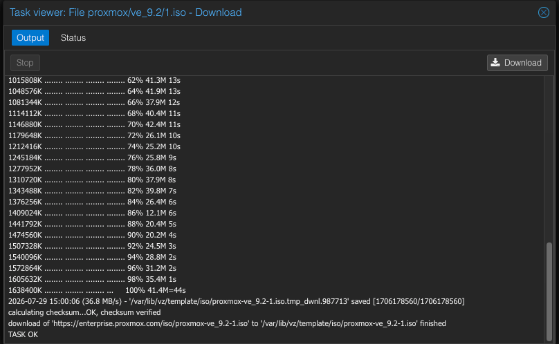
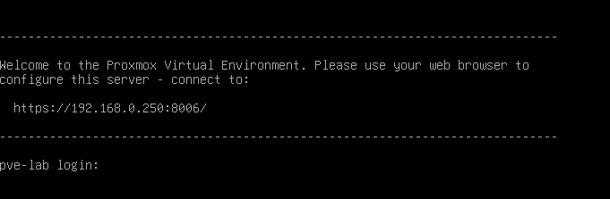
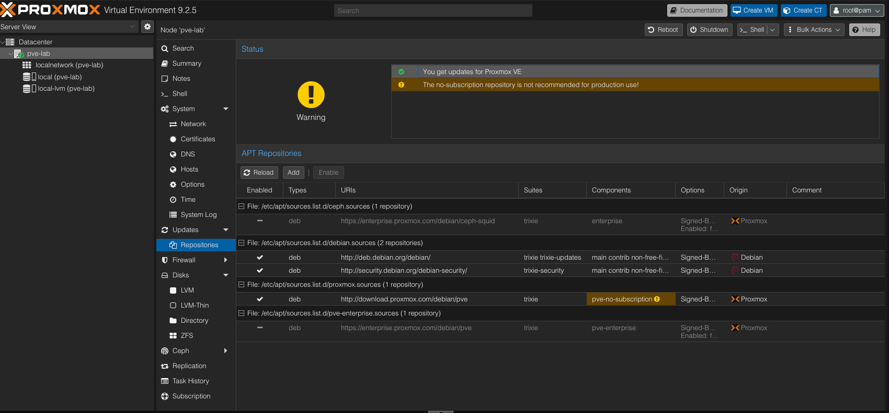
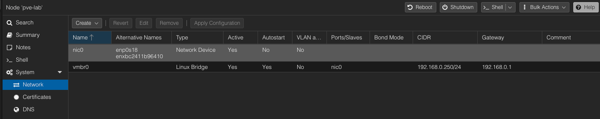
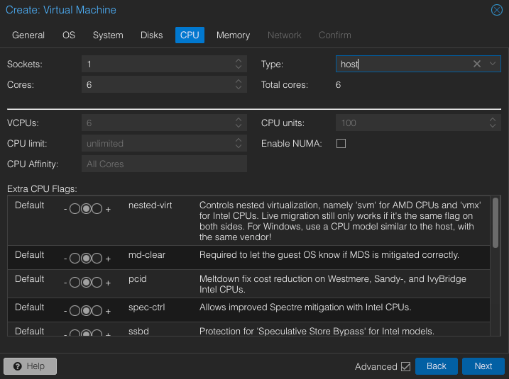
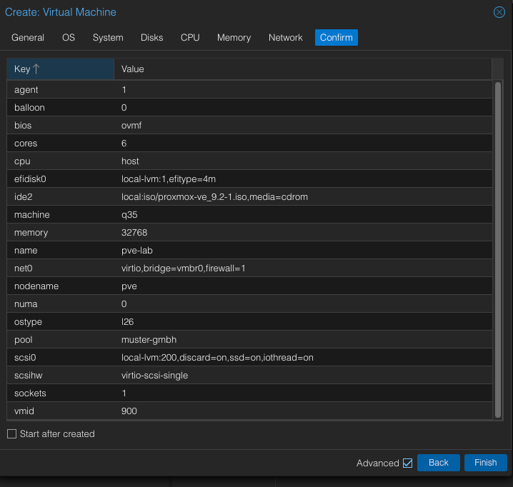
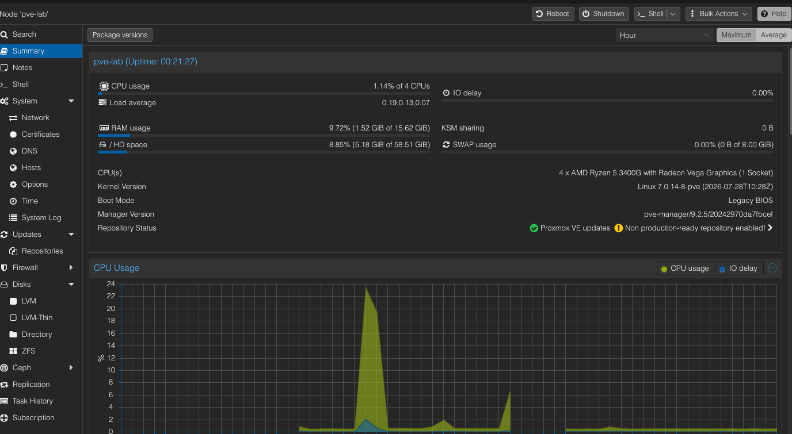

# Fundament – Aufbau der virtualisierten Laborumgebung

| | |
|---|---|
| **Projekt** | Muster GmbH – IT-Infrastruktur |
| **Baustein** | Fundament (Basis-Hypervisor des Labors) |
| **Bearbeitet von** | Alix Chaparro |
| **Datum** | 2026-07-30 |
| **Status** | Abgeschlossen |

---

## 1. Zielsetzung


Ziel dieses Bausteins ist der Aufbau eines eigenständigen, isolierten Hypervisors
als Grundlage für die gesamte Laborumgebung der Muster GmbH. Auf diesem Hypervisor
werden in den folgenden Bausteinen die virtuellen Maschinen des Szenarios betrieben
(Firewall, Windows Server, Clients, Exchange).

Der Hypervisor wird bewusst als **verschachtelte Installation** (nested Proxmox VE)
innerhalb des bestehenden produktiven Proxmox-Servers aufgebaut. Dadurch bleibt das
Labor vollständig vom Produktivsystem getrennt und der Aufbau kann als eigenständige,
von Grund auf dokumentierte Komponente nachvollzogen werden.

---

## 2. Ausgangssituation und Rahmenbedingungen


Der bestehende produktive Proxmox-Server (Host) dient als physische Grundlage.
Innerhalb dieses Hosts wird eine virtuelle Maschine erstellt, die selbst als
Hypervisor fungiert.

**Host (physischer Server):**

| Merkmal | Wert |
|---|---|
| Betriebssystem | Proxmox VE 9.1.1 |
| CPU | AMD Ryzen 5 3400G (4 Kerne / 8 Threads) |
| Virtualisierung | AMD-V |
| Nested Virtualization | aktiviert (`kvm_amd nested = 1`) |
| Arbeitsspeicher | 60 GiB (+ 8 GiB Swap) |
| Management-IP | 192.168.0.5 |
| Speicher (VM-Disks) | `local-lvm` (LVM-Thin) |


**Reservierung für das Labor:**

- Ressourcen-Pool: `muster-gmbh`
- VM-ID-Bereich: `900`–`999`
- Netzwerk: Management über Bridge `vmbr0` (192.168.0.0/24). Die interne, isolierte Segmentierung des Labornetzes erfolgt in Baustein 1 (OPNsense).

---

## 3. Technische Entscheidung: Nested Proxmox

Für das Labor wird ein eigener Hypervisor benötigt, da die späteren Komponenten
(Windows Server, Windows-Clients, OPNsense, Exchange) keine Programme auf einem
Linux-System sind, sondern eigenständige virtuelle Maschinen. Diese müssen von
einem Hypervisor bereitgestellt werden.

Die Umsetzung als **nested Proxmox** wurde gewählt, weil:

- das Labor dadurch vollständig vom Produktivsystem isoliert ist,
- der Aufbau des Hypervisors selbst als eigenständiger, von Grund auf dokumentierbarer
  Baustein nachvollziehbar bleibt.

---

## 4. Umsetzung


### 4.1 Erstellung der virtuellen Maschine (VM 900)

Auf dem Host wurde die VM `900` (`pve-lab`) mit folgender, bewusst konservativer
Konfiguration erstellt:

| Parameter | Wert | Begründung |
|---|---|---|
| Arbeitsspeicher | 16384 MB (Installation) → 32768 MB (Betrieb) | für die Installation genügten 16 GiB; für den Betrieb aller Labor-VMs wurde der Wert auf 32 GiB (32768 MB) erhöht (siehe Screenshot unten) |
| Prozessoren | 4 Kerne, Typ `host` | `host` gibt die CPU-Flags durch → nötig für verschachteltes KVM |
| BIOS | SeaBIOS | stabil, keine Secure-Boot-Komplexität |
| Maschinentyp | i440fx | bewährt für diese Konfiguration |
| Festplatte | 200 GB (`local-lvm`, VirtIO SCSI) | |
| Netzwerk | VirtIO, Bridge `vmbr0` | |
| QEMU Guest Agent | aktiviert | saubere Steuerung durch den Host |





*Arbeitsspeicher für den Betrieb auf 32 GiB angehoben (hostet alle Labor-VMs):*




### 4.2 Installation von Proxmox VE


Die Installation erfolgte über das offizielle ISO-Abbild `proxmox-ve_9.2-1.iso`.
Vor der Installation wurde die Integrität des Abbilds über die SHA256-Prüfsumme
sichergestellt (Download direkt über Proxmox mit automatischer Prüfsummenkontrolle).



Wesentliche Installationsparameter:

| Parameter | Wert |
|---|---|
| Zielfestplatte | `/dev/sda` (200 GB) |
| Land / Zeitzone | Germany / Europe/Berlin |
| Hostname (FQDN) | `pve-lab.fritz.box` |
| IP-Adresse | 192.168.0.250/24 |
| Gateway | 192.168.0.1 |
| DNS-Server | 192.168.0.1 |

<!-- TODO: Screenshot des Installer-Schritts „Management Network Configuration"
     mit den endgültigen Werten (pve-lab.fritz.box, 192.168.0.250/24) fehlt.
     Das Ergebnis ist durch fundament-04 (Netzwerk) und fundament-05b (Konsole)
     belegt, der Installationsschritt selbst jedoch nicht.
     ES: falta la captura del paso de red con los valores definitivos. El
     resultado sí está probado por fundament-04 y fundament-05b. -->


### 4.3 Erststart und Boot-Reihenfolge

Nach der Installation wurde die Boot-Reihenfolge angepasst, sodass die VM von
der Festplatte (`scsi0`) startet. Das Installationsmedium (`ide2`) wurde dabei
aus der Boot-Reihenfolge entfernt – die ISO bleibt im Laufwerk eingebunden,
wird jedoch nicht mehr zum Starten verwendet.



<!-- TODO: Screenshot von Optionen → Boot Order fehlt; die geänderte Reihenfolge
     (scsi0 aktiv, ide2 entfernt) ist damit nicht belegt. Die vorhandene
     Aufnahme zeigt ausschließlich die Konsole nach dem Erststart.
     ES: falta captura de Options → Boot Order. -->


### 4.4 Paketquellen (Repositories) konfigurieren

Da für das Labor keine Enterprise-Subscription vorliegt, wurden die Enterprise-Quellen
deaktiviert und die **No-Subscription-Quelle** aktiviert. Anschließend wurde das
System aktualisiert.

```bash
apt update && apt full-upgrade -y
```




### 4.5 QEMU Guest Agent installieren

```bash
apt install qemu-guest-agent -y
```

Der Guest Agent ermöglicht dem Host eine saubere Steuerung der VM (geordnetes
Herunterfahren, Anzeige der IP-Adresse). Er wird über einen virtio-Kanal aktiviert,
der in den Optionen der VM 900 aktiviert sein muss.

---

## 5. Netzwerkkonfiguration




| Merkmal | Wert |
|---|---|
| Management-IP | 192.168.0.250/24 |
| Gateway | 192.168.0.1 |
| Bridge | `vmbr0` |


---

## 6. Aufgetretene Probleme und Lösungen


| Problem | Ursache | Lösung |
|---|---|---|
| Installer bricht mit *Kernel Panic* ab | zu aggressive VM-Konfiguration | konservative Werte (SeaBIOS, i440fx, CPU-Typ `host`, 4 Kerne) |
| Installation schlägt bei Paket `ceph-common` / `unsquashfs` fehl | beschädigtes bzw. unvollständiges ISO-Abbild | ISO über Proxmox neu geladen und per SHA256-Prüfsumme verifiziert |
| Timeout beim Herunterfahren („guest agent is not running") | Guest Agent im Gast noch nicht installiert | Guest Agent installiert und virtio-Kanal aktiviert |
| Weboberfläche (`:8006`) nicht erreichbar, `pveproxy`-Worker in Endlosschleife | verklemmter Dienst-Zustand nach Aktualisierung | vollständiger Neustart der VM (nicht nur der Dienste) |

### Erster Versuch – aggressive Konfiguration

Die VM 900 wurde zunächst mit deutlich höheren Werten angelegt: 6 Kerne,
32768 MB Arbeitsspeicher, UEFI-Firmware (OVMF) und Maschinentyp `q35`. Diese
aggressivere Konfiguration führte zu den oben beschriebenen Installationsfehlern,
insbesondere zum Abbruch des Installers mit einem *Kernel Panic*. Erst die
konservative Konfiguration aus Abschnitt 4.1 (4 Kerne, SeaBIOS statt OVMF,
i440fx statt q35) führte zu einer erfolgreichen Installation. Ursache der
Abbrüche waren die Firmware (OVMF) und der Maschinentyp (q35), **nicht** der
Arbeitsspeicher – dieser wurde für den späteren Betrieb ohnehin wieder auf
32 GiB gesetzt.

Die folgenden Aufnahmen dokumentieren diesen ersten, fehlgeschlagenen Versuch.
Sie zeigen **nicht** die endgültige Konfiguration der VM 900.





In diesem Baustein habe ich drei wichtige Dinge gelernt. Erstens: Man sollte
eine ISO-Datei vor der Installation immer mit der SHA256-Prüfsumme kontrollieren,
damit sie nicht kaputt ist. Zweitens: Eine einfache VM-Konfiguration (SeaBIOS,
i440fx, wenige Kerne) funktioniert bei der Installation besser als eine zu große.
Drittens: Wenn ein Dienst nicht mehr funktioniert, hilft ein kompletter Neustart
der VM oft mehr, als nur den Dienst neu zu starten.

---

## 7. Ergebnis


Der Baustein Fundament ist abgeschlossen. Es steht ein eigenständiger, aktualisierter
Proxmox-VE-Hypervisor (Version 9.2.5) für das Labor zur Verfügung. Repositories und
Guest Agent sind korrekt konfiguriert.




**Erreichter Zustand:**

- Nested Proxmox VE 9.2.5 installiert und aktualisiert
- No-Subscription-Repository aktiv, Enterprise-Quellen deaktiviert
- QEMU Guest Agent installiert und aktiv
- Erreichbar unter `https://192.168.0.250:8006`

---

## 8. Nächste Schritte


- **Baustein 1 – OPNsense:** Aufbau der Firewall und des internen Labornetzes.
- <!-- TODO: weitere geplante Bausteine -->

---