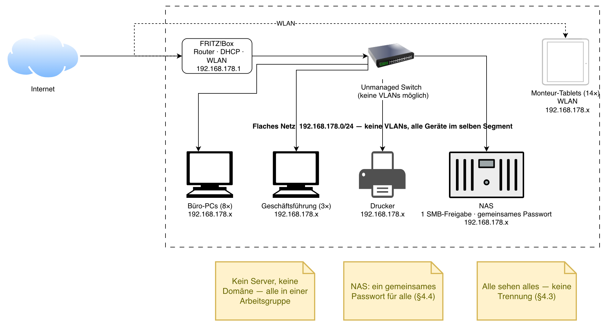
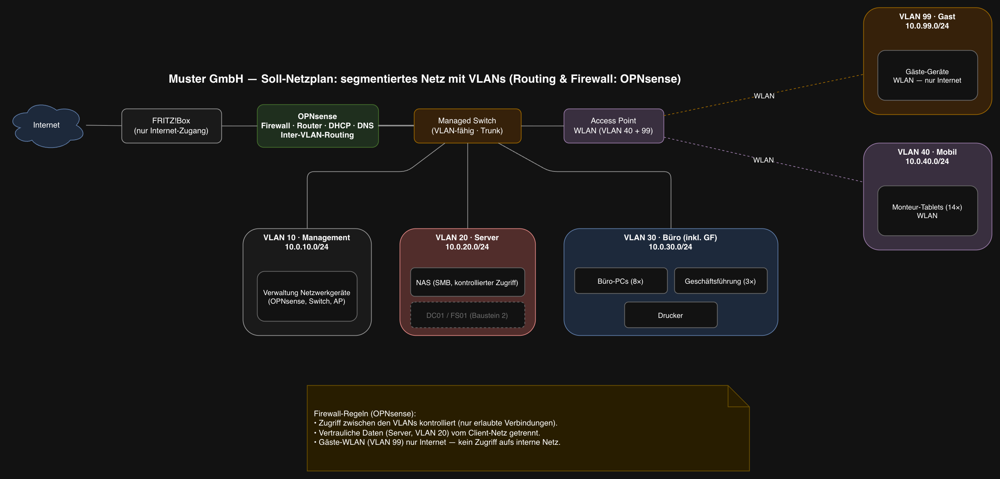

# Baustein 1 – Netzwerk: Segmentierung mit VLANs

| | |
|---|---|
| **Projekt** | Muster GmbH – IT-Infrastruktur |
| **Baustein** | 1 · Netzwerk (Netzplan + OPNsense) |
| **Bearbeitet von** | Alix Chaparro |
| **Datum** | 2026-08-05 |
| **Status** | In Bearbeitung |

---

## 1. Zielsetzung

Ziel dieses Bausteins ist die Ablösung des flachen, ungetrennten Netzwerks der
Muster GmbH durch ein **segmentiertes Netzwerk mit VLANs**. Durch die Trennung in
logische Netze werden vertrauliche Daten von allgemeinen Arbeitsdaten getrennt,
der Zugriff zwischen den Bereichen wird kontrollierbar, und es entsteht die
Grundlage für den späteren Server- und Domänenbetrieb (Baustein 2).

Der Entwurf berücksichtigt die Rahmenbedingungen des Kunden: begrenztes Budget
(R1), kein Stillstand im Außendienst (R2) und Bedienbarkeit ohne eigenes
IT-Personal (R3). Die Umsetzung erfolgt daher bewusst schlank – fünf VLANs auf
einem verwaltbaren Switch und einer OPNsense-Firewall, nicht mit
überdimensionierter Enterprise-Technik.

---

## 2. Ist-Zustand

Die nachfolgenden Angaben zum Ist-Zustand stammen aus der Ist-Aufnahme vor Ort
am 05.08.2026 (siehe Rahmenprojekt, Terminplan).

### 2.1 Ist-Netzplan

Zum Zeitpunkt der Kontaktaufnahme (Erstgespräch, 27.07.2026) betreibt die
Muster GmbH ein einziges, **flaches Netzwerk**. Ein Consumer-Router (FRITZ!Box)
übernimmt Routing, DHCP und WLAN in Personalunion. Alle Geräte – die 8
Büro-Arbeitsplätze, die 3 Rechner der Geschäftsführung, die 14 Monteur-Tablets
(per WLAN), ein Drucker und ein NAS – befinden sich im selben Subnetz
`192.168.178.0/24` und damit in **derselben Broadcast-Domäne**.

Ein **nicht verwaltbarer (unmanaged) Switch** verteilt die kabelgebundenen
Anschlüsse. Mit diesem Switch sind VLANs technisch **nicht möglich**. Es
existiert **kein Server und keine Domäne**; alle Rechner arbeiten in einer
Arbeitsgruppe. Der Zugriff auf das NAS erfolgt über eine **einzige Freigabe mit
einem gemeinsamen, allen bekannten Passwort**.

### 2.2 Messbarer Ist-Zustand

<!-- ES: Datos medibles del "antes". Se comparan luego con el Soll. -->

| Merkmal | Ist-Wert |
|---|---|
| Subnetze | 1 (`192.168.178.0/24`) |
| Broadcast-Domänen | 1 |
| VLANs | 0 |
| Netzwerksegmentierung | keine |
| DHCP-Server | 1 (FRITZ!Box, für alle Geräte gemeinsam) |
| Zentrale Benutzerverwaltung | keine (Arbeitsgruppe, kein Domänencontroller) |
| NAS-Zugriff | 1 Freigabe, 1 gemeinsames Passwort |
| Geräte im selben Segment | 11 PCs (8 Büro + 3 GF) + 1 Drucker + 1 NAS kabelgebunden, 14 Tablets per WLAN = 27 Geräte in 1 Segment |

### 2.3 Resultierende Probleme

Aus dem flachen Netz ergeben sich direkt die vom Kunden geschilderten Probleme:

- **Keine Trennung vertraulicher Daten** (Kundenanfrage §4.3): Lohn- und
  Personalunterlagen liegen im selben Zugriff wie Baustellenfotos; jeder
  Mitarbeitende – auch Auszubildende – kann alles einsehen.
- **Gemeinsames Passwort ohne Nachvollziehbarkeit** (§4.4): Niemand weiß, wer
  welchen Zugang hat; ausgeschiedene Mitarbeitende kennen das Passwort weiterhin.
- **Kein geregelter Zugriff aus dem Außendienst** (§4.2): Die Monteure erreichen
  die Bürodaten von der Baustelle nicht; der Austausch läuft über Telefon und
  private WhatsApp-Nachrichten.

---

## 3. Soll-Zustand

### 3.1 Soll-Netzplan

Das flache Netz wird durch ein **segmentiertes Netzwerk mit fünf VLANs** ersetzt.
Zentrale Komponente ist die **OPNsense-Firewall**, die Routing zwischen den VLANs,
DHCP je VLAN, DNS und die Firewall-Regeln übernimmt. Der bisherige unmanaged Switch
wird durch einen **verwaltbaren Switch** ersetzt, der die VLANs als Trunk führt. Das
WLAN wird nicht mehr von der FRITZ!Box, sondern von einem **Access Point** bereitgestellt,
der getrennte SSIDs für die Monteur-Tablets (VLAN 40) und für Gäste (VLAN 99) anbietet.
Die FRITZ!Box dient nur noch als Internet-Zugang.

### 3.2 VLAN- und Adressplan

| VLAN | Name | Subnetz | Gateway | Zweck |
|---|---|---|---|---|
| 10 | Management | `10.0.10.0/24` | `10.0.10.1` | Verwaltung der Netzwerkgeräte (OPNsense, Switch, AP) |
| 20 | Server | `10.0.20.0/24` | `10.0.20.1` | NAS; künftig Windows Server / Fileserver (Baustein 2) |
| 30 | Büro | `10.0.30.0/24` | `10.0.30.1` | Büro-PCs, Geschäftsführung, Drucker |
| 40 | Mobil | `10.0.40.0/24` | `10.0.40.1` | Monteur-Tablets (WLAN) |
| 99 | Gast | `10.0.99.0/24` | `10.0.99.1` | Gäste-WLAN, isoliert |

Adressierungs-Konvention: die VLAN-ID steht im dritten Oktett (`10.0.<VLAN>.0/24`),
das Gateway jeder VLAN liegt auf `.1` (OPNsense).

### 3.3 Zugriffskonzept (Firewall-Regeln in OPNsense)

Der Zugriff zwischen den VLANs wird durch Regeln auf der OPNsense gesteuert:

- **Büro (30)** darf auf **Server (20)** zugreifen (Dateizugriff auf das NAS).
- **Mobil (40)** darf – nach Umsetzung des Fileservers – gezielt auf freigegebene
  Server-Dienste zugreifen; sonst nur Internet.
- **Gast (99)** erhält **ausschließlich Internet-Zugang**, keinen Zugriff auf interne VLANs.
- **Management (10)** ist nur von administrativen Geräten erreichbar.
- Nicht ausdrücklich erlaubter Verkehr zwischen VLANs wird **standardmäßig blockiert**.

---

## 4. Umsetzung mit OPNsense

<!-- TODO: Installation OPNsense, VLANs, DHCP pro VLAN, DNS, Firewall-Regeln
     zwischen den Segmenten. Mit Screenshots. -->

*(folgt – Implementierung in OPNsense)*

---

## 5. Ergebnis / Soll-Ist-Vergleich

<!-- TODO: Tabelle Ist vs. Soll (Subnetze, VLANs, Segmentierung, DHCP ...)
     und Nachweis der Erreichbarkeitsregeln zwischen den VLANs. -->

*(folgt – Vergleich und Nachweis)*

---
